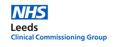

    
    
    

# Networked Data Lab: NDL Leeds analysis on access of childrens' and young people's mental health services and transition to adult mental health services.

#### Project Status: In-progress

## Project Description

- This Networked Data Lab analysis by the NDL lab in Leeds focusses on childrens' and young people's (11-25) mental health, particularly disparities in service access between different groups across Leeds, and confounding factors associated with transition from child/adolescent services to adult services.
- Please note that these research outputs have not yet been peer-reviewed and should be treated as preliminary.

## Data sources

This analysis used the following data:

- Mental Health Services Data Set ([MHSDS](https://digital.nhs.uk/data-and-information/data-collections-and-data-sets/data-sets/mental-health-services-data-set)), comprising data from all NHS-funded mental-health organisations.
Data included patient lists and associated demographics; referrals, including sources,
routes, and outcomes; and care contacts/activities. Data did not include IAPT referrals or IAPT care
contacts.
- Secondary Uses Service ([SUS](https://digital.nhs.uk/services/secondary-uses-service-sus)), comprising data from all secondary care providers. Data included
inpatient, outpatient, and accident and emergency.
- Yorkshire Ambulance Service Data (YAS), including 111 calls.
- Improving Access to Psychological Therapies ([IAPT](https://digital.nhs.uk/data-and-information/data-collections-and-data-sets/data-sets/improving-access-to-psychological-therapies-data-set)), comprised of data for patients with anxiety and
depression.
- Primary Care Records for all Leeds-registered patients (from EMIS & SystmOne)
- Mortality data
- Office of National Statistics [census data](https://www.ons.gov.uk/census/2011census) and [population estimates](https://www.ons.gov.uk/peoplepopulationandcommunity/populationandmigration/populationestimates/datasets/lowersuperoutputareamidyearpopulationestimates)
- LSOA level deprivation data ([2019 Indices of Deprivation](https://www.gov.uk/government/statistics/english-indices-of-deprivation-2019))

## How does it work?

## Requirements

These scripts were written in R (4.1.3) and SQL (SQL Server 13), and utilise RStudio's projects.

## Getting started

To run the project, go to the `/Codes/` directory. If running using RStudio, then 
load the `leeds-project-2.RProj` file, which will set the paths. If RStudio 
isn't being used, then please set the working directory to `Codes` via
`setwd('.../NDL_CYPMH_Leeds/Codes')`.

Two versions of the report can be created: the full report, or an executive 
summary. To build the full report, please run `NDLProject2.Rmd`, and to build 
the summary report please run `NDLProject2ExecutiveSummary.Rmd`. No patient data
is required to build the summary report, so this can be built immediately, but 
to build the full report, patient identifiable data is required.

As patient data has not been saved in this repository, a direct connection to 
the Leeds Data Model (LDM) database will be required, which is administered by 
Leeds CCG and the North East Commissioning Service (NECS). Please contact 
Souheila Fox if you believe you should have permission to access this data.

Once you have access to the LDM, you can update `Codes/config.yml` with the 
correct driver and server to access. By default, it is assumed that you have a 
trusted connection, but if you have been given a username and password then you 
can enter them there.

### Outputs
If you do not have permission to access any data then the aggregated outputs are
still available for access. The final versions of the reports are saved in the
`/Report/` directory, and aggregated data taken from the full version of the 
report can be found in `output/figure_outputs/`.

## Authors

- Benjamin Alcock - [email](ben.alcock1@nhs.net)
- Frank Wood - [email](frank.wood@leeds.gov.uk)
- Alex Brownrigg - [email](a.brownrigg@nhs.net)
- Souheila Fox - [email](souheila.fox@nhs.net)

## License

This project is licensed under the [MIT License](https://opensource.org/licenses/MIT).
